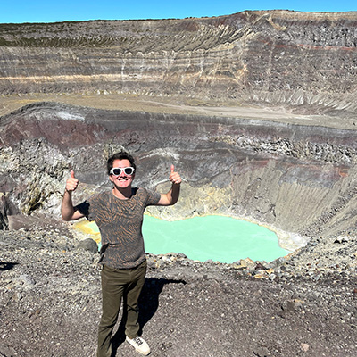

Hi! I'm glad you've taken the time to visit my website and that you're interested in learning more about me.

I'm currently a Master's student at [Brown University](https://www.brown.edu/) (one of the eight **Ivy League** private research universities) studying **Cybersecurity**. I'm enrolled in the Computer Science track which focuses on the technical and computational aspects of Cybersecurity, while gaining a complementary perspective on human factors and law. I previously completed my undergraduate studies at [North Carolina State University](https://www.ncsu.edu/) where I graduated **summa cum laude** in Mathematics with a minor in Computer Programming.

I have experience with secure software development, computer architecture, and networking, as well as mathematical and applied cryptography. My main areas of interest are **Computer Security** and **Cryptography** in order to protect networks, devices, and data. My goal is to specialize in penetration testing and the management of IT systems to solve complex, real-world security problems.

#### Education

- Sc.M. in Cybersecurity (Computer Science track) at [Brown University](https://www.brown.edu/), *expected 05/2024*
- B.S. in Mathematics with Minor in Computer Programing at [North Carolina State University](https://www.ncsu.edu/), *05/2022*
- Study abroad program at [Università di Pisa](https://www.unipi.it/), *12/2021*
- Supplementary high school experience with the [North Carolina School of Science and Mathematics](https://www.ncssm.edu/) Online Program

#### Work Experience

- Cybersecurity Intern at [Fermi National Accelerator Laboratory](https://www.fnal.gov/) through the U.S. Department of Energy's OMNI Technology Alliance Internship Program, *Summer 2023*

E-mail: [simongreenblatt@gmail.com](mailto:simongreenblatt@gmail.com)  
LinkedIn: [Link](https://www.linkedin.com/in/simon-greenblatt)  
Resume: [Link](resume_cyber.pdf)

  
I like to climb volcanos!
