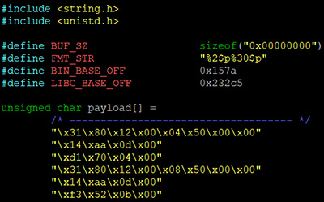
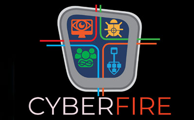
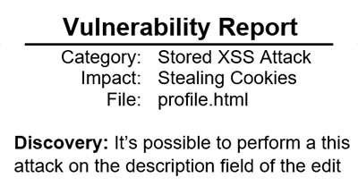

## Developing Shellcode

Using disassembly and debug tools, I **reverse engineered a binary** that was hardened using non-executable memory and full ASLR. This binary contained both a stack-based buffer overflow and a format string vulnerability which allowed me to leak memory addresses in order to bypass ASLR. I then **developed a JIT-ROP payload** that hijacked the control flow of the program and initiated a ret2libc attack. The purpose of this capture-the-flag exercise was to pass the value of a hidden symbol as an argument into a function. I then successfully restored the execution of the program by cleaning up any trashed registers.

**Timeline:** September - December 2023  
**Techniques:** Stack Pivoting, ret2libc, JIT-ROP  
**Technologies:** x86 Assembly, ROPgadget, gdb, objdump

## Participating in a Hackathon

I participated in the 2023 OMNI Fire training and competition. This event included two days of lab-heavy training on cybersecurity tools and topics including network archeology, host forensics, and **malware analysis**. The two-day competition involved solving puzzles related to password cracking, threat hunting, protocol reverse engineering, and other cybersecurity categories. I helped my team by recovering hidden files using steganographic tools and **reconstructing a simulated incident** from payload delivery, through persistence, to data exfiltration.

**Timeline:** August 2023  
**Techniques:** File Carving, Packet Inspection, Forensic Analysis  
**Technologies:** Autopsy, Hashcat, Wireshark, Python, Foremost

## Bypassing Access Controls

In this exercise I break a fictitious autograding system to steal other student's assignments and trick it into giving me a good grade. I use my knowledge of file permissions, **setuid Linux programs**, and process isolation to create exploits that take advantage of vulnerabilities I found in the source code. As an exercise in **privilege escalation**, I demonstrate how safelists, input sanitization, and the principle of least privilege can be used to prevent users from circumventing access controls.

**Timeline:** March - April 2023  
**Attacks:** Arbitrary Code Execution, Symlink Traversal, Path Sanitization Bypass  
**Technologies:** Golang, Bash script, Unix

## Hacking a Website

I took advantage of a poorly configured website to perform unauthorized actions on its web server. An unsanitaized username field allowed me to create a **SQL injection** attack to bypass a password check on a login page; I used a Stored XSS attack to steal user's cookies that had the HttpOnly flag set to false; By noticing that the website didn't use CSRF tokens, I was able to perform actions on behalf of unsuspecting users who clicked a malicious link to an HTML file with a hidden POST request. My **vulnerability reports** detail the discovery, impact, and mitigation of these and other attacks.

**Timeline:** February - March 2023  
**Attacks:** SQL Injection, Stored XSS, CSRF, Insecure Direct Object Reference  
**Technologies:** HTML, JavaScript, SQL, Burp Suite

## Breaking Weak Cryptography

Did you know that until 2020 Zoom meetings were encrypted using AES in ECB mode? My first target for these attacks was an encrypted database of student grades whose format and layout was known. By exploiting the weaknesses of ECB mode and using **statistical correlation**, I was able to learn information about student's grades. I also performed a brute force attack to **recover the encryption key** of an encryption scheme that uses a 16-bit initialization vector. Finally, I created a Python script to recover the keys of a double encryption scheme by performing a meet-in-the-middle attack on a midway ciphertext.

**Timeline:** February 2023  
**Attacks:** Statistical Cryptanalysis, Meet-in-the-Middle, Brute Force  
**Technologies:** Python, Java

All attacks were performed in a safe and simulated environment.
