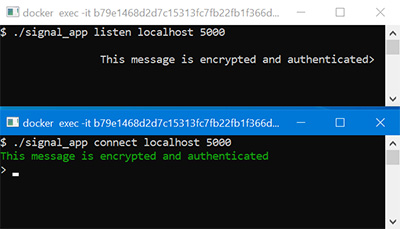
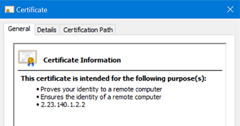

## Secure Communication Framework

The most fundamental problem in cryptography is that of establishing a **secure communication channel** that provides both message security and integrity. This program accomplishes just that. Two clients connect to each other to exchange encrypted and verified text messages through a command line interface. A **Diffie-Hellman ratchet** ensures keys are changed every time the direction of communication switches. The following cryptographic parameters are used – Key Exchange: Diffie-Hellman and HKDF. Encryption: 256-bit AES in CBC mode with random IV. Message Authentication: HMAC-SHA256 with salt.

**Timeline:** January - May 2023  
**Technologies:** C++, CryptoPP, Docker, Visual Studio

## Public Key Infrastructure

This client-server authentication platform leverages **digital signatures** in order for a central verification authority to issue certificates that authenticate users' public keys. Clients log in to a server using a password and two-factor authentication response to obtain a certificate that verifies their identity when communicating with other users. Passwords are hashed using a salt and pepper before being stored in a SQL database. This program achieves an authenticated key exchange that is secure against **man-in-the-middle attacks**.

**Timeline:** January - May 2022  
**Technologies:** C++, Docker, Visual Studio, SQLite

## Thread Safety and Synchronization

We like threads to cooperate by using shared memory. But what happens when two threads try to concurrently access the same memory? This project examines different ways of resolving race conditions and the **critical section problem**. Noun and adjective generators initialize threads that must share structures in a bounded buffer before they can be printed to the screen. In order to ensure mutual exclusion of memory among threads, I used **semaphores**, mutexes, and condition variables.

**Timeline:** January - May 2022  
**Technologies:** EOS Linux, POSIX System Calls, Von Neumann Architecture

## Data Structures and Algorithms Library

This **Java** library of over 30 data structures and algorithms demonstrates the importance of **algorithmic complexity** in relation to the choice of data structures. In it, I've coded linked-list and array-based variations of stacks, queues, trees, lists, graphs, hash tables, and other structures. I've also included implementations of related algorithms such as Quicksort, Breadth-first search, Dijkstra's Algorithm, tree traversal algorithms, and many others. This project was built using the principles of Object-Oriented Programming and does not rely on existing Java libraries.

**Timeline:** January - May 2021  
**Technologies:** Java, Eclipse, Jenkins, GitHub

## Movie Database

This program manages a database of movie entries that are loaded from a file. The command line interface allows the user to sort and display movies by genre or release date. By using the C language, a **low-level procedural programming** approach allowed me to explore concepts such as memory leaks, function pointers, and **dynamic memory allocation**. As a behind-the-scenes look at object orientation, this project exposes how techniques like inheritance and overriding work in C++.

**Timeline:** January - May 2021  
**Technologies:** C language, Valgrind, GNU Debugger (GDB), GitHub

## Management System Application

Based on the Model-View-Controller design pattern, I developed a **management application** for handling the customers, inventory, and orders of a fictional business. This project gave me experience with the **software development lifecycle**, debugging techniques, continuous integration practices, and unit/system testing. From UML class diagrams to user stories, this project took a comprehensive look at software development processes and practices.

**Timeline:** August - December 2020  
**Technologies:** Java, Eclipse, UMLet, GitHub

Due to academic integrity policies, I'm not able to provide source code for some or all of my projects.
