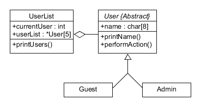
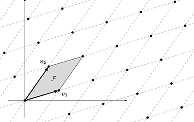
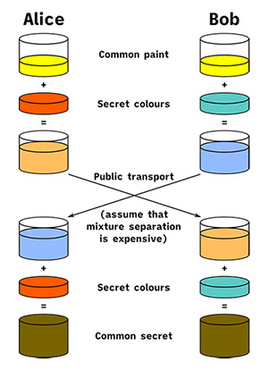

## Data-Only Attacks

As software defense mechanisms like ASLR and CFI become more common, it's increasingly difficult to hijack control flow and carry out a code reuse attack. My Master's capstone project explores a subset of **data-only attacks** known as Counterfeit Objected-Oriented Programming (COOP) which are unaffected by these defenses. In this paper I introduce vlogin: a vulnerable program that demonstrates the principles of COOP by performing a data-only **privilege escalation** attack. I explain the design and vulnerabilities of vlogin and walkthrough the reverse engineering process as well as the attack approach.

**Timeline:** March - May 2024  
**Keywords:** Counterfeit Object-Oriented Programming, Data-Only Attacks, Memory Corruption  
**Link:** [vlogin: A Prototype on Counterfeit Object-Oriented Programming and Data-Only Attacks](data-only_attacks.pdf)  
**Link to Source Code:** [vlogin.zip](vlogin.zip)

## Lattice-Based Cryptography

My undergraduate Mathematics capstone project puts forth the theory of **lattices** as a viable source of **quantum-resistant** cryptographic problems. In it, I discuss the GGH and NTRU lattice-based cryptosystems as well as their mathematical background. I also introduce the LLL lattice reduction algorithm as a tool for **cryptanalysis** on lattices. As part of this project, I coded a version of the LLL algorithm (in the C language) and presented my results to the Mathematics Honors Program at my university.

**Timeline:** January - May 2021  
**Keywords:** Lattices, Post-quantum Cryptography, Lattice Reduction  
**Link:** [A Mathematical Introduction to Lattice-Based Cryptography](lattices.pdf)

## Usability of Authentication

"You're only as strong as your weakest link". Too often companies rely on security training and password complexity requirements to ensure proper use of **authentication mechanisms**. However, this overexposure to training bombardment can lead to security fatigue. This paper argues that usability is a better approach to achieving security goals while reducing friction in the user experience. I address usability in the context of **password management**, multi-factor authentication, security questions, and mobile authentication.

**Timeline:** September - December 2022  
**Keywords:** Usability, MFA, Password Management, Human Factors  
**Link:** [A Usability Approach to The Authentication Problem](usability.pdf)

## Cybersecurity of Critical Infrastructure

The U.S. government has adopted a voluntary, nonregulatory, incentive-based framework for protecting the various critical infrastructure sectors. This has led to a jumble of incentives and a general lack of legislation. I this paper, I lay out an agenda for increasing adoption of the **NIST Cybersecurity Framework** and expanding the role of the CISA information sharing program while taking into account the **economic, social, and moral incentives** at play. I also advocate for a reassessment of the definition for "commercial information technology product".

**Timeline:** September - December 2022  
**Keywords:** Critical Infrastructure, NIST Cybersecurity Framework, CISA, Law  
**Link:** [An Agenda for Improving the Cybersecurity of Critical Infrastructure](critical_infrastructure.pdf)

## Diffie-Hellman Key Exchange

The seminal 1976 paper *New Directions in Cryptography* by Whitfield Diffie and Martin Hellman laid out the foundation for public-key cryptography. This collaborative paper examines the mathematics behind the Diffie-Hellman Key Exchange. We provide an algebraic background to the **discrete logarithm problem** and a concrete example of the algorithm in action. Additionally, we discuss computational difficulties in implementing it and explain how the **Binary Exponential Algorithm** solves these problems.

**Timeline:** January - May 2021  
**Keywords:** Key-exchange, Discrete Logarithm, Binary Exponential Algorithm  
**Link:** [The Diffie-Hellman Key Exchange](key_exchange.pdf)
